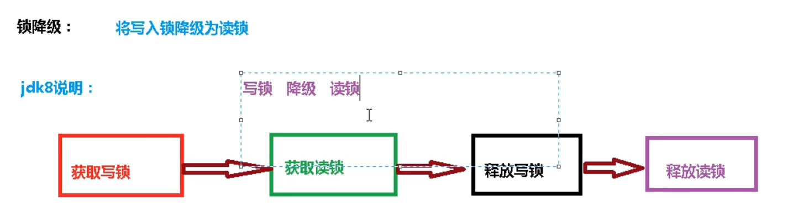
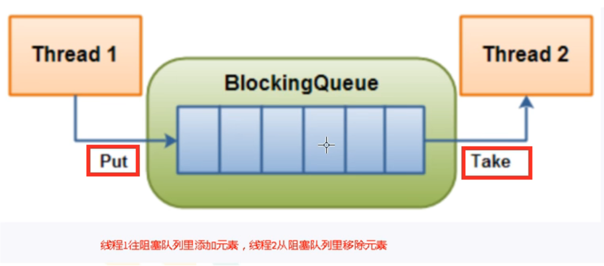
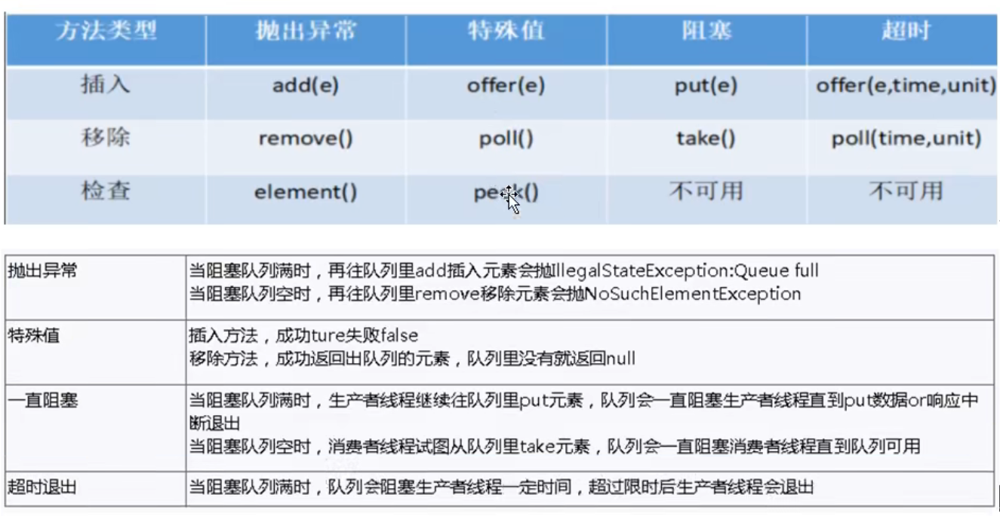
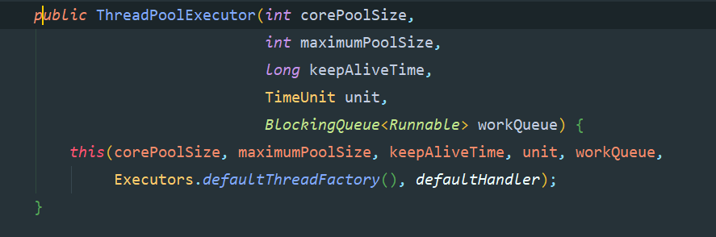
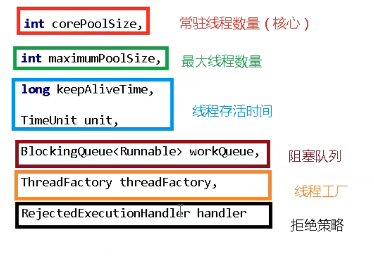
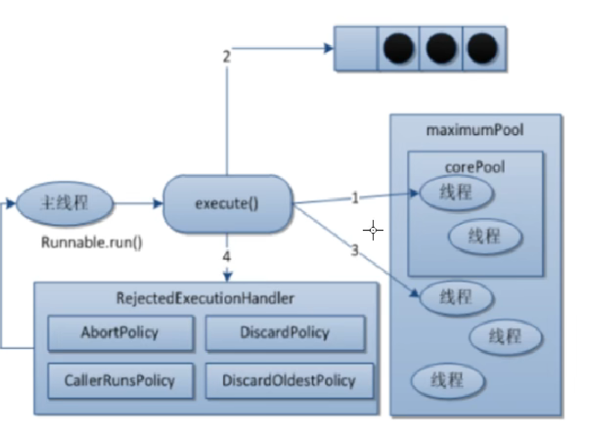
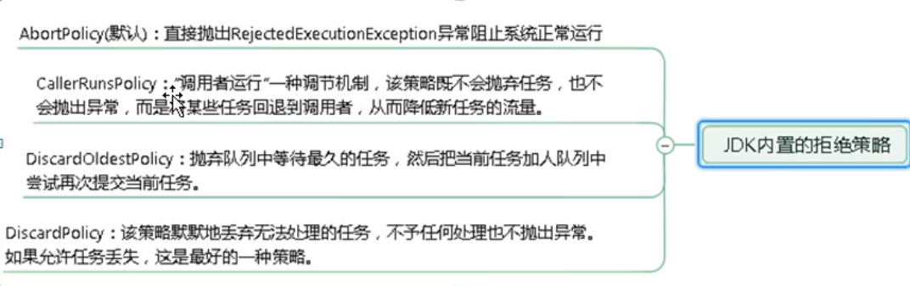

# 1：synchronized锁

java的每一个对象都可以作为一个锁
- 1：对于普通方法，锁的是当前new出来的这个对象
- 2：对于静态同步方法，锁的是当前类的Class对象
- 3：对于同步代码块，锁的是synchronized括号里配置的对象


# 2：公平锁和非公平锁
传入true是公平锁

传入false是非公平锁

```private final ReentrantLock lock = new ReentrantLock(true);```

```java
//这个是  ReentrantLock 底层的构造方法


/**
      * Creates an instance of {@code ReentrantLock}.
      * This is equivalent to using {@code ReentrantLock(false)}.
      */
    public ReentrantLock() {
           sync = new NonfairSync();
       }
  /**
    * Creates an instance of {@code ReentrantLock} with the
    * given fairness policy.
    *
    * @param fair {@code true} if this lock should use a fair ordering policy
    */
   public ReentrantLock(boolean fair) {
       sync = fair ? new FairSync() : new NonfairSync();
   }
```
- 非公平锁：线程饿死，效率高    
  - 例子：假如发现一个凳子，就直接坐上去
- 公平锁：阳光普照，效率相对较低
  - 例子：加入发现了一个凳子，先问是否有人吗，如果没有，再坐上去，所以效率低


# 3：可重入锁

- ``synchronized（隐式）lock（显式）这两个都是可重入锁``

解释：可重入锁就是  把家里大门的锁打开，房间里面的们就不用开锁了，可以自由进入所有的房间

```java
public static void main(String[] args) {
        Object o = new Object();
        new Thread(()->{
            synchronized (o){
                System.out.println(Thread.currentThread().getName()+"外层");
                synchronized (o){
                    System.out.println(Thread.currentThread().getName()+"中层");
                    synchronized (o){
                        System.out.println(Thread.currentThread().getName()+"内层");
                    }
                }
            }

        },"T1").start();
    }


输出：
T1外层
T1中层
T1内层   
```


# 4：死锁

#### 1：什么是死锁：

**两个或者两个线程在执行过程中，因为在争夺资源中造成一种互相等待的现象，如果没有外力的干涉，他们就没有办法执行下去了**

****


#### 2：产生死锁的原因

- **系统资源不足**
- **进程运行推进顺序不合适**
- **资源分配不当**

```java
/**
 * @author Stewart
 * @create 2022/2/19
 * @Description 演示死锁
 */
public class DeadLockDemo {
    static Object a = new Object();
    static Object b = new Object();

    public static void main(String[] args) {
        new Thread(()->{
            synchronized (a){
                System.out.println(Thread.currentThread().getName()+"持有锁a,试图获取锁b");
                try {
                    TimeUnit.SECONDS.sleep(1);
                } catch (InterruptedException e) {
                    e.printStackTrace();
                }
                synchronized (b){
                    System.out.println(Thread.currentThread().getName()+"获取锁b");
                }
            }
        },"AA").start();

        new Thread(()->{
            synchronized (b){
                System.out.println(Thread.currentThread().getName()+"持有锁b,试图获取锁a");
                try {
                    TimeUnit.SECONDS.sleep(1);
                } catch (InterruptedException e) {
                    e.printStackTrace();
                }
                synchronized (a){
                    System.out.println(Thread.currentThread().getName()+"获取锁a");
                }
            }
        },"AA").start();
    }
}
```


#### 3：验证是否是死锁

- jps：能查看当前运行的线程
- jstack：jvm自带的堆栈跟踪工具


# 5：线程

## 1：创建线程的多种方式

#### 1：继承Thread类

#### 2：实现Runable接口

```java
//复杂的方式
class MyThread1 implements Runnable{

    @Override
    public void run() {

    }
}
public class Demo1 {
    public static void main(String[] args) {
        new Thread(new MyThread1(),"A").start();
    }
}

//简化的方式

new Thread(()->{
   
},"AA").start();
```

#### 3：Callable接口

```java
//复杂的写法
class MyThread2 implements Callable{

    @Override
    public Object call() throws Exception {
        return 200;
    }
}

public class Demo1 {
    public static void main(String[] args) {
        //Callable的方式
        //需要通过FutureTask
         FutureTask futureTask1 = new FutureTask<>(new MyThread2());
        
        //简便的写法
        FutureTask futureTask2 = new FutureTask<>(()->{
            return 1024;
        });
    }
}
	
       
```

##### 1:FutureTask

- **原理：未来任务**

``例子``

1：老师上课了，口渴了，去买水不合适，讲课的线程继续。

单开启线程让班长帮忙去买水

把水买回来了，需要就直接get

#### 4：线程池的方式


#### 5：Runable接口和Callable接口的区别

##### 1：是否有返回值

- Runable没有返回值
- Callable有返回值

##### 2：是否抛出异常

- Runable没有异常
- Callable有异常

##### 3：实现方法的名称不同

- Runable用的是run方法
- Callable用的是call方法

#### 6:juc的工具类 

##### 1：CountDownLatch：减少计数

```例子``

```java
// 6个同学陆续离开教师，才能锁门
public class CountDownLatchDemo {
    // 6个同学陆续离开教师，才能锁门
    public static void main(String[] args) {

        for (int i = 1; i <= 6; i++) {
            new Thread(()->{
                System.out.println(Thread.currentThread().getName()+"离开了教师");
            },String.valueOf(i)).start();
        }

        System.out.println(Thread.currentThread().getName()+"班长锁门走人了");
    }
}
```


**结果很明显是不正确的**

- 正确：

```java
public class CountDownLatchDemo {
    // 6个同学陆续离开教师，才能锁门
    public static void main(String[] args) {
        CountDownLatch countDownLatch = new CountDownLatch(6);
        for (int i = 1; i <= 6; i++) {
            new Thread(()->{
                //每次计数减一
                countDownLatch.countDown();
                System.out.println(Thread.currentThread().getName()+"离开了教师");
            },String.valueOf(i)).start();
        }
        //等待
        try {
            countDownLatch.await();
        } catch (InterruptedException e) {
            e.printStackTrace();
        }
        System.out.println(Thread.currentThread().getName()+"班长锁门走人了");
    }
}
```


##### 2：CyclicBarrier：循环栅栏

``例子``

7颗龙珠召唤神龙

```java
public class CyclicBarrierDemo {

    //创建固定值
    private static final int NUMBER = 7;

    public static void main(String[] args){
        CyclicBarrier cyclicBarrier = new CyclicBarrier(NUMBER,()->{
            System.out.println("7颗龙珠召唤神龙");
        });
        for (int i = 0; i < NUMBER; i++) {
            new Thread(()->{
                System.out.println(Thread.currentThread().getName()+"龙珠");
                try {
                    cyclicBarrier.await();
                } catch (InterruptedException e) {
                    e.printStackTrace();
                } catch (BrokenBarrierException e) {
                    e.printStackTrace();
                }
            },String.valueOf(i)).start();
        }

    }
}
```

##### 3：Semaphore：信号灯

``例子``

6辆车，3个停车位

```java
public class SemaphoreDemo {

    public static void main(String[] args) {
        Semaphore semaphore = new Semaphore(3);

        //模拟6辆车
        for (int i = 0; i < 6; i++) {
            new Thread(()->{
                try {
                    semaphore.acquire();
                    System.out.println(Thread.currentThread().getName()+"成功抢到了车位");

                    //设置随机停车时间
                    TimeUnit.SECONDS.sleep(new Random().nextInt(5));
                    System.out.println(Thread.currentThread().getName()+"离开了车位");
                } catch (InterruptedException e) {
                    e.printStackTrace();
                } finally {
                    //释放
                    semaphore.release();
                }
            },String.valueOf(i)).start();
        }
    }
}
```

# 6:读写锁

## 1：悲观锁

**不支持并发**


## 2：乐观锁

**通过版本号进行控制**


## 3：表锁

表锁不会发生死锁

## 4：行锁

行锁会发生死锁

## 5：读锁：共享锁，发生死锁

## 6：写锁：独占锁，发生死锁

``读写锁例子``

```java
class MyCache {
    //创建一个map集合
    private volatile Map<String, Object> map = new HashMap<>();

    private ReadWriteLock rwlock = new ReentrantReadWriteLock();
    //放数据
    public void put(String key, Object value) {
        rwlock.writeLock().lock();

        try {
            System.out.println(Thread.currentThread().getName() + "写操作" + key);

            TimeUnit.MICROSECONDS.sleep(300);
            //放数据
            map.put(key, value);
            System.out.println(Thread.currentThread().getName() + "写完成" + key);
        } catch (InterruptedException e) {
            e.printStackTrace();
        }finally {
            //释放读写锁
            rwlock.writeLock().unlock();
        }

    }

    public Object get(String key) {
        rwlock.readLock().lock();
        Object result = null;
        try {
            System.out.println(Thread.currentThread().getName() + "正在读取操作" + key);

            TimeUnit.MICROSECONDS.sleep(300);
            result = map.get(key);
            System.out.println(Thread.currentThread().getName() + "读取完了" + key);
        } catch (InterruptedException e) {
            e.printStackTrace();
        }finally {
            rwlock.readLock().unlock();
        }

        return result;
    }
}

public class ReadWriteLockDemo {
    public static void main(String[] args) {
        MyCache myCache = new MyCache();
        //创建线程往里面放数据
        for (int i = 0; i < 5; i++) {
            final int num = i;
            new Thread(() -> {
                myCache.put(num + "", num + "");
            }, String.valueOf(i)).start();
        }

        //创建线程取数据
        for (int i = 0; i < 5; i++) {
            final int num = i;
            new Thread(() -> {
                myCache.get(num + "");
            }, String.valueOf(i)).start();
        }
    }
}
```

## 7：读写锁概念

**读写锁：一个资源可以被多个读线程访问，或者可以被一个写线程访问，但是能同时存在读写线程，读写互斥，**读读共享****


## 8：锁降级



例子：

```java
public class Demo1 {
    public static void main(String[] args) {
        //可重入读写锁对象
        ReentrantReadWriteLock rwLock = new ReentrantReadWriteLock();
        //读锁
        ReentrantReadWriteLock.ReadLock readLock = rwLock.readLock();
        //写锁
        ReentrantReadWriteLock.WriteLock writeLock = rwLock.writeLock();

        //锁降级
        //获取写锁
        writeLock.lock();
        System.out.println("hello");

        //2:获取读锁
        readLock.lock();
        System.out.println("---read");

        //3:释放写锁
        writeLock.unlock();

        //4：释放读锁
        readLock.unlock();
    }
}
```

# 7：阻塞队列

## 1：阻塞队列概况

- 一个线程往里面放，一个线程往外面取



## 2：阻塞队列的架构BolockingQueue(接口)

- ArrayBlockingQueue
- LinkedBlockingQueue



# 8：线程池

## 1：线程池的概述

**线程池的工作只要控制运行的线程数量，处理过程中将任务放到队列中，然后再线程创建后启动这些任务，如果线程的数量超过了最大的数量，超出的数量就会排队等待，等其他线程执行完毕，再从队列中取出任务来执行**

### 1：主要特点

- **减低资源的消耗**
- **提高响应的速度**
- **提高线程的可管理性**
- **java中的线程池是通过Executor框架实现的。该框架用到了Executor，Executors，ExecutorService,ThreadPoolExecutor这几个类**


### 2：线程池的三种使用方式


```java
/**
 * @author Stewart
 * @create 2022/2/21
 * @Description  线程池的演示
 */
public class ThreadPoolDemo01 {
    public static void main(String[] args) {
        //一池n线程
        ExecutorService threadPool = Executors.newFixedThreadPool(5);

        //一池一线程
        ExecutorService threadPool2 = Executors.newSingleThreadExecutor();

        //一池可扩容线程
        ExecutorService threadPool3 = Executors.newCachedThreadPool();
        try {
            for (int i = 0; i < 50; i++) {
                threadPool3.execute(()->{
                    System.out.println(Thread.currentThread().getName()+"办理业务");
                });
            }
        }finally {
            threadPool3.shutdown();
        }


    }
}
```

### 3:ThreadPoolExecutor的参数讲解

**底层源码**








- **线程数和阻塞队列都满了的话，会执行拒绝策略**】

### 4：jdk的4种拒绝策略




### 5：自定义线程池的例子

```java
/**
 * @author Stewart
 * @create 2022/2/21
 * @Description  自定义线程池的创建
 */
public class ThreadPoolDemo02 {
    public static void main(String[] args) {
        ExecutorService threadPool = new ThreadPoolExecutor(
                2, 5, 2L, TimeUnit.SECONDS, new ArrayBlockingQueue<>(3),
                Executors.defaultThreadFactory(), new ThreadPoolExecutor.AbortPolicy()
        );

        try {
            for (int i = 0; i < 50; i++) {
                threadPool.execute(()->{
                    System.out.println(Thread.currentThread().getName()+"办理业务");
                });
            }
        }finally {
            threadPool.shutdown();
        }
    }
}
```


